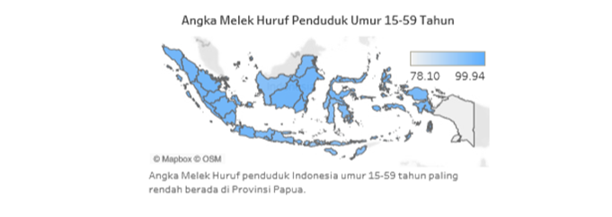
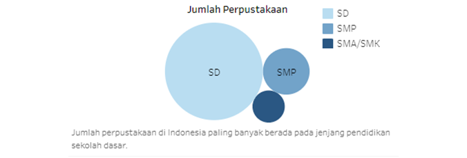

# 221911164-3SD1-Visdat
(Projek UAS take home mata kuliah Visualisasi Data dan Informasi kelas 3SD1 tahun ajaran 2021/2022)

<h2><b>DASHBOARD INTERAKTIF VISUALISASI DATA STATISTIK PENDIDIKAN INDONESIA</b></h2>

<h3><b>Abstrak</b></h3>

Ringkasan— Sarana dan prasarana pendidikan merupakan salah satu faktor yang memengaruhi kualitas pendidikan. Hasil dan capaian proses pendidikan dapat dilihat dari beberapa indikator, diantaranya Angka Melek Huruf (AMH). Rata-rata lama sekolah, dan tingkat penyelesaian sekolah. Secara umum, penelitian ini bertujuan untuk membuat dashboard interaktif dari visualisasi data statistik pendidikan Indonesia tahun 2019,2020,2021 serta melakukan evaluasi dashboard. Data yang digunakan merupakan data sekunder yang bersumber dari publikasi bps, web BPS, dan web Kemendikbud, serta data primer yang bersumber dari hasil kuesioner responden. Anlisis yang digunakan yaitu deskriptif dan inferensia. Visualisasi yang digunakan adalah choropleth map, pie map chart, stacked bar chard, diagram sunburst, dan bubble map. Visualisasi digabungkan dalam sebuah dashboard interaktif. Berdasarkan hasil evaluasi, dengan jumlah responden 10, didapatkan skor 90 sehingga mendapatkan nilai huruf A yang artinya sangat baik. Berdasarkan uji Mann-Whitney dapat disimpulkan bahwa bahwa tidak ada perbedaan persepsi penilaian antara kedua kelompok responden. Dimana kelompok responden terbagi menjadi dua yaitu kelompok lingkup pendidikan dan  kelompok masyarakat masyarakat umum.

Kata Kunci— pendidikan, dashboard, visualisasi, system usability scale, mann-whitney

<h3><b>Latar Belakang</b></h3>

Pendidikan merupakan faktor yang penting dan merupakan tonggak pembangunan masa depan sebuah bangsa. Indonesia adalah negara kepulauan yang teriri dari 34 provinsi. Indonesia memiliki empat tujuan nasional, dimana salah satunya adalah “mencerdaskan kehidupan bangsa”. Berdasarkan Kamus Besar Bahasa Indonesia, pendidikan diartikan sebagai proses,cara, perbuatan mendidik. Pendidikan juga diartikan sebagai proses mengubah sikap dan tata laku seseorang atau kelompok orang dalam usaha mendewasakan manusia melalui upaya pengajaran dan pelatihan.

Menurut Lengeveld, pendidikan adalah usaha mempenganrhi, melindungi serta memberikan banfuan yang te(uju kepada kedewasaan aaak didiknya atau dengan kata lain membantu aDak didik agar cukup mampu dalam melaksanakan tugas hidupnya sendii tanpa bantuan orang lain [1]. 

Undang-Undang Republik Indonesia (UU RI) No. 20 tahun 2003 tentang Sistem Pendidikan Nasional Pasal 45 menyebutkan bahwa setiap satuan pendidikan menyediakan sarana dan prasarana yang memenuhi keperluan pendidikan sesuai dengan pertumbuhan dan perkembangan potensi fisik, kecerdasan intelektual, sosial, emosional, dan kejiwaan peserta didik. Kondisi serta sarana dan prasarana antar provinsi berbeda-beda dan terdapat perubahan tiap tahunnya. Sementara, sarana dan prasarana pendidikan merupakan salah satu faktor yang memengaruhi kualitas pendidikan. Pemenuhan sarana dan prasarana pendidikan yang baik diharapkan dapat meningkatkan kualitas pendidikan masyarakat Indonesia. 

Hasil dan capaian proses pendidikan dapat dilihat dari beberapa indikator, diantaranya yaitu Angka Melek Huruf (AMH). rata-rata lama sekolah, dan tingkat penyelesaian sekolah. Data tentang hal tersebut dapat membantu pemerintah mengambil kebijakan yang tepat untuk dilaksanakan guna meningkatkan kualitas pendidikan generasi penerus bangsa. 
Setiap tahun, Badan Pusat Statistik mengeluarkan publikasi mengenai statistik pendidikan Indonesia. Pada tahun 2019, Badan Pusat Statistik mengeluarkan publikasi yang berjudul Potret Pendidikan Statistik Pendidikan Indonesia Tahun 2019. Tahun 2020, Badan Pusat Statistik mengeluarkan publikasi yang berjudul Statistik Pendidikan 2020, serta di tahun 2021 publikasi berjudul Statistik Pendidikan 2021. Untuk tiap publikasi tersebut, terdapat 5 bab, yaitu pendahuluan, sarana dan prasarana, partisipasi sekolah, kegiatan siswa, serta hasil dan capaian proses pendidikan. 

Data-data pendidikan tersebut terdapat di web pemerintahan seperti web Kementrian Pendidikan dan Kebudayaan, web Badan Pusat Statistik, maupun di publikasi BPS mengenai Statistik Pendidikan Indonesia. Namun, kebanyakan orang tidak tertarik melihat data statis. Selain itu, jika hanya menggunakan data statis akan memakan waktu cukup lama untuk menganalisis dan mengambil kebijakan. Untuk mengatasi hal tersebut, dapat dilakukan teknik visualisasi data. 

Visualisasi adalah salah satu cara menampilkan informasi dari data secara interaktif. Dengan bentuk visualisasi yang interaktif atau dinamis, informasi dari data dapat dilihat dengan jelas dan mudah dipahami. Referensi [2] menjelaskan bahwa visualisasi adalah rekayasa dalam pembuatan gambar, diagram atau animasi untuk penampilan suatu informasi dalam penjelasan lain visualisasi adalah konversi data ke dalam format visual atau tabel sehingga karakteristik dari data dan relasi diantara item data atau atribut dapat di analisis atau dilaporkan, dan visualisasi data adalah satu dari yang teknik paling baik dan menarik untuk eksplorasi data. 
Visualisasi data tersebut dapat dijadikan satu di dalam dashboard interaktif agar pengguna lebih mudah melihat berbagai visualisasi tersebut. Desain dashboard yang baik akan memberikan informasi yang akurat. Oleh karena itu, pembuatan dashboard informasi visualisasi data interaktif sangat penting untuk melihat data sarana dan prasarana pendidikan di Indonesia serta persebaran hasil capaian proses pendidikan berdasarkan provinsi di Indonesia karena dengan adanya informasi dan perencanaan yang matang diharapkan dapat menjawab tantangan pembangunan di bidang pendidikan yang sedang dan akan dihadapi.

<h3><b>Tujuan Penelitian</b></h3>

1. 
Membuat visualisasi data interaktif menggunakan tableau tentang sarana dan prasarana pendidikan yang meliputi jumlah sekolah berdasarkan jenjang pendidikan dan provinsi di Indonesia, jumlah perpustakaan di Indonesia, dan kondisi ruang kelas di Indonesia tahun 2019-2021 sehingga bisa diperoleh gambaran perkembangan sarana dan prasarana pendidikan Indonesia dengan lebih cepat dan menarik.

2. 
Membuat visualisasi data interaktif tentang hasil dan capaian proses pendidikan yang meliputi beberapa indikator, yaitu angka melek huruf anak usia ≥15 tahun berdasarkan provinsi, rata-rata lama pendidikan anak usia ≥15 tahun berdasarkan provinsi, serta tingkat penyelesaian pendidikan menurut jenjang pendidikan dan provinsi di Indonesia tahun 2019-2021 sehingga bisa diperoleh gambaran persebaran hasil dan capaian proses pendidikan di tiap provinsi Indonesia dengan cepat dan menarik.

3. 
Membangun dashboard interaktif untuk visualisasi data sarana dan prasarana pendidikan serta hasil dan capaian proses pendidikan tahun 2019-2021 yang mampu menyajikan visualisasi data interaktif secara komprehensif.

4. 
Untuk mengetahui penilaian terhadap dashboard interaktif visualisasi data statistik pendidikan Indonesi oleh pengguna yang terbagi menjadi dua kelompok pengguna.

5. 
Untuk mengetahui perbedaan persepsi penilaian dashboard interaktif visualisasi data statistik pendidikan Indonesia oleh dua kelompok pengguna.

<h3><b>Penelitian Terkait</b></h3>

Dalam referensi [6], Ruktin Handayani dan Mohammad Arif Rasyidi melakukan penelitian pada tahun 2019 dengan judul Visualisasi Interaktif Persebaran Toko Daring di Indonesia Menggunakan Crowdsourced Data. Data yang digunakan dalam penelitian ini adalah hasil dari crowdsourced data yang bersumber dari toko daring di Indonesia. Data dianalisis dan diproses untuk menghasilkan statistik tentang distribusi toko daring berdasarkan wilayah dan jenis barang. Statistik ini ditampilkan dalam bentuk visualisasi peta untuk kemudahan penggunaan. Dengan adanya visualisasi tersebut, pemerintah atau pemegang kepentingan akan dapat memantau perkembangan toko daring di masing-masing wilayah. Metodologi penelitian yang dilakukan yaitu pengumpulan data, analisis dan pra-pemrosesan, data transformation, desain dan pembangunan software visualisasi, serta uji coba dan evaluasi.

Pada referensi [9], Dimas Setiawan dan Naufal Rafianto melakukan penelitian dengan pada tahun 2020 dengan judul Pengukuran Usability pada Learning Management System Perguruan TInggi Menggunakan Pedoman System Usability Scale. Penelitian ini akan melakukan evaluasi untuk mengungkap kondisi usability ELMA (e-learning Universitas PGRI Madiun). evaluasi usablity yang bisa dilakukan salah satunya dengan menggunakan SUS (System Usability Scale). Berdasarkan hasil evaluasi usability terhadap 30 responden mahaiswa di berbagai lintas angkatan program studi sistem informasi, platform ELMA memiliki skor rata-rata sebesar 44 dengan rating rendah dan nilai huruf F. Hal ini menunjukkan bahwa ELMA masih memiliki tingkat kegunaan/usability yang masih rendah. Sehingga perlu adanya perbaikan.

Referensi [10] menjelaskan bahwa Hafidz Isa Nasruddin Lizana dan Farid Ridho pada tahun 2021 melakukan penelitian dengan judul Implementasi dan Evaluasi Visualisasi Data Interaktif pada Publikasi Laporan Bulanan Data Sosial Ekonomi Indonesia. Dalam penelitian ini, mereka menggunakan beberapa indikator penilaian yang tercakup dalam lima kelompok penilaian, yaitu dampak visual, performa secara keseluruhan, desain secara keseluruhan, kualitas informasi, serta model representasi visual. Dilakukan analisis deskriptif untuk menganalisis penilaian responden terhadap SIVIS LBDSE berdasarkan kuesioner yang telah dibagikan. Untuk mengetahui perbedaan persepsi penilaiain visualisasi data interaktif antara dua kelompok responden, dilakukan uji Mann Whitney dengan tingkat signifikansi 5%. 

Referensi [7] menjelaskan bahwa Willy Arief Pramono, Hanifah Muslimah Az-Zahra, dan Retno Indah Rokhamawati melakukan penelitian pada tahun 2019 yang berjudul Evaluasi Usability pada Aplikasi MyTelkomsel dengan Menggunakan Metode Usability Testing. Penelitian ini bertujuan untuk melakukan evaluasi usability pada aplikasi MyTelkomsel versi 3.14 platform android untuk melakukan pengujian usability pada aplikasi dengan menggunakan metode Usability Testing untuk mengetahui tingkat usability dari aplikasi tersebut. Setelah peneliti melakukan observasi langsung, maka ditentukan bahwa pengguna dari aplikasi MyTelkomsel dibagi menjadi 2, yaitu pengguna baru dan pengguna lama. Evaluasi usability pada aplikasi MyTelkomsel menggunakan metode Usability Testing dengan menggunakan 5 kriteria yang tersedia, yaitu learnability, efficiency, memorability, error, dan satisfaction. dapat dikatakan bahwa aplikasi MyTelkomsel dapat dengan mudah diingat oleh pengguna pada saat pengguna tidak menggunakan sistem lagi dalam jangka waktu lama. Untuk kriteria error didapatkan nilai 1,31% yang artinya untuk kriteria ini dapat dikategorikan rendah. Sedangkan untuk satisfaction didapatkan skor 69 dari kuesioner SUS dan hasilnya berada diatas rata-rata skor penilaian.

<h3><b>Metodologi Penelitian</b></h3>

Berikut diagram alur penelitian Dashboard Interaktif Visualisasi Data Statistik Pendidikan Indonesia. 

Gambar 1. Alur Penelitian

<b>A. Metode Pengumpulan Data</b>

Data yang digunakan dalam penelitian ini merupakan data sekunder dan primer. Data sekunder merupakan data yang diperoleh melalui media perantara atau secara tidak langsung. Dalam penelitian ini, digunakan enam data sekunder yang berasal dari beberapa sumber. Pertama, yaitu data jumlah sekolah berdasarkan jenjang pendidikan SD,SMP, SMA/SMK menurut provinsi di Indonesia yang bersumber dari Data Pokok Pendidikan Direktorat Jendral Pendidikan Anak Usia Dini, Pendidikan Dasar dan Pendidikan Menengah, Kementrian Pendidikan, Kebudayaan, Ristek dan Teknologi semester ganjil untuk tahun 2019/2020, 2020/2021, 2021/2022. Data dapat diakses pada link https://dapo.kemdikbud.go.id/sp. Data kedua dan ketiga yaitu data persentase ruang kelas menurut jenjang pendidikan dan kondisi serta data jumlah perpustakaan sekolah negeri menurut jenjang pendidikan yang bersumber dari publikasi BPS, yaitu Potret Pendidikan Statistik Pendidikan Indonesia Tahun 2019, Statsitik Pendidikan Indonesia Tahun 2020, dan Statistik Pendidikan Indonesia Tahun 2021. Data keempat yaitu angka melek huruf penduduk umur 15-59 tahun menurut provinsi, kelima data rata-rata lama sekolah penduduk umur ≥15 tahun menurut provinsi, data keenam yaitu data tingkat penyelesaian pendidikan menurut jenjang pendidikan dan provinsi. Data keempat, kelima, dan keenam bersumber dari web Badan Pusat Statistik yang dapat diakses pada link https://bps.go.id/.

Data primer merupakan data yang diperoleh secara langsung yang dikumpulkan dengan metode pengumpulan data, seperti pengisian kuesioner dan lain sebagainya. Dalam penelitian ini, data primer didapatkan dari pengisian kuesioner system usability scale untuk evaluasi dashboard interaktif visualisasi data statistik pendidikan Indonesia. 

<b>B.	Pemilihan Chart dan Pembuatan Visualisasi</b>

Terdapat berbagai jenis chart yang dapat digunakan untuk memvisualkan data. Pemilihan chart disesuaikan dengan jenis data dan kategori yang digunakan.  Untuk melakukan visualisasi data tersebut, peneliti menggunakan tools Tableau.

<b>C.	Pembuatan Desain dan Publikasi Dashboard</b>

Dashboard merupakan tampilan visual dari informasi penting untuk mencapai satu atau banyak tujuan; dikonsolidasikan dan diatur pada satu layar sehingga informasi dapat dimonitor secara sekilas. Esensi dari dashboard yaitu menyajikan informasi untuk mencapai suatu tujuan tertentu yang berada pada satu layar utuh. Dashboard memiliki mekanisme tampilan yang kecil, ringkas, jelas, dan intuitif. Penataan ruang: tempat yang paling penting dilihat dari kiri atas (jika bahasanya ditulis ke kiri kanan) lalu atur tampilan berikut seperti pola huruf Z dengan informasi paling penting mengikuti pola dari atas ke bawah, kiri ke kanan

Dashboard yang di desain dengan baik dapat menyajikan data yang terorganisir dengan baik, terkondensasi, spesifik dan disesuaikan untuk pembaca dan tujuan dari organisasi, serta ditampilkan dengan media yang ringkas agar pesan dashboard tersebut tersampaikan dengan jelas. Pembuatan desain dashboard menggunakan tools Tableau. Dashboard dipublikasikan menggunakan server Tableau Publik.

<b>D.	Evaluasi Dashboard Interaktif</b>

Penelitian ini menggunakan System Usability Scale (SUS) untuk mengevaluasi dashboard interaktif visualisasi data statistik pendidikan Indonesia. Setiawan dan Ravianto (2020), menyebutkan bahwa, System Usability Scale (SUS) adalah kuesioner yang dapat digunakan untuk mengukur usablity sistem pada komputer dari sudut pandang subjektif para pengguna. SUS banyak digunakan untuk mengukur kegunaan dan memiliki beberapa kelebihan. 

Secara teknis, SUS memiliki 10 butir pertanyaan yang dikemas dalam bentuk kuesioner, tetapi dalam pengembangannya bisa dimungkinkan dibuat dalam bentuk gambar yang dinamakan PictorialSUS [11], namun dalam penelitian ini hanya menggunakan kuesioner. Pertanyaan pada kuesioner system usability scale dapat dilihat pada Tabel 1.

Kuesioner SUS memiliki 10 pertanyaan dengan penilaian menggunakan skala liert pada rentang 1-5, dimana poin 1 artinya sangat tidak setuju, 2 artinya tidak setuju, tiga berarti netral, 4 yaitu setuju, dan 5 adalah sangat setuju. Dalam menentukan hasil perhitungan skor SUS, terdapat tiga sudut pandang penelitian, yaitu acceptability, grade scale, dan adjective rating. Seperti pada gambar 2 berikut.

Gambar 2. Standar Penetuan Skor SUS [12]

Pembobotan skor untuk menyatakan status dashboard berada pada rentang 0-100 serta dibagi menjadi 5 nilai huruf dari A,B,C,D, dan  F.

<b>E. Metode Analisis</b>

Pada penelitian ini, dilakukan analisis deskriptif pada data sekunder, yaitu data jumlah sekolah berdasarkan jenjang pendidikan SD,SMP, SMA/SMK menurut provinsi di Indonesia, persentase ruang kelas menurut jenjang pendidikan, kondisi serta data jumlah perpustakaan sekolah negeri menurut jenjang pendidikan, angka melek huruf penduduk umur 15-59 tahun menurut provinsi, rata-rata lama sekolah penduduk umur ≥15 tahun menurut provinsi,serta data tingkat penyelesaian pendidikan menurut jenjang pendidikan dan provinsi di Indonesia untuk tahun 2019-2021. Selain itu, analisis deskriptif juga dilakukan untuk menganalisis penilaian responden terhadap dashboard interaktif visualisasi data statistic pendidikan Indonesia berdasarkan kuesioner yang telah dibagikan. 

Penelitian ini juga menggunakan analisis inferensia menggunakan tools IBM SPSS Statistics 25 untuk melakukan uji Mann-Whitney dengan tujuan mengetahui perbedaan persepsi penilaian dashboard visualisasi data interaktif antara kelompok lingkup pendidikan dan masyarakat umum. Kelompok lingkup pendidikan mencakup mahasiswa jurusan pendidikan, pendidik berbagai jenjang pendidikan, dan sejenisnya. Kelompok masyarakat umum merupakan masyarakat yang tidak tercakup pada kelompok lingkup pendidikan. 

<h3><b>Hasil dan Pembahasan</b></h3>

<b><i>Dashboard</i> Interaktif</b>

Berdasarkan alur pembuatan dashboard yang telah dijelaskan pada metodologi, hasil dashboard interaktif visualisasi data statistik pendidikan Indonesia dapat dilihat pada gambar 3. Dashboard dapat diakses pada link https://public.tableau.com/app/profile/dwi.karunia.syaputri/viz/DashboardInteraktifVisualisasiDataStatistikPendidikanIndonesia_/DASHBOARDPENDIDIKAN?publish=yes. 

Gambar 3. Gambar Tampilan <i>Dashboard</i>

Pada gambar 3 di atas, tampilan dashboard di dominasi warna biru, serta terdapat warna oren, hijau, dan abu-abu pada judul-judul visualisasi. Dashboard tersebut memaparkan data sekunder yang digunakan dalam penelitian ini. Berikut gambar dan penjelasan tiap bagian pada dashboard.

Gambar 4. Gambar Tampilan Judul <i>Dashboard</i>

Judul menjadi salah satu unsur penting dalam dashboard yang merupakan representasi isi dashboard. Judul pada dashboard ini menggunakan warna abu-abu pada background agar membuat mata pembaca fokus pada judul dashboard.

Gambar 5. Fitur Seleksi Tahun pada Tampilan <i>Dashboard</i>

Seperti pada Gambar 5, terdapat fitur untuk  memilih tahun data yang ditampilkan, yaitu 2019,2020, dan 2021. Seluruh visualisasi secara otomatis akan menampilkan data pada tahun yang dipilih pada fitur tersebut. 

Gambar 6. AMH Indonesia

Gambar 7. <i>Choropleth Map</i> AMH

Gambar 6 dan 7 menampilkan angka melek huruf untuk Indonesia dan Angka Melek Huruf berdasarkan provinsi di Indonesia. Data angka melek huruf penduduk umur 15-59 tahun berdasarkan provinsi di Indonesia divisualkan menggunakan choropleth map secara interaktif. Value akan muncul saat pengguna melakukan hover pada provinsi yang ingin dilihat datanya. Di bagian kiri terdapat beberapa fitur, yaitu zoom in dan zoom out peta, filter, search, selection, dan detail on demand. Choropleth map ini digunakan pada data yang memiliki variable geografi, yaitu menampilkan data dalam bentuk peta dengan warna yang berbeda-beda antar daerah sesuai rentang nilai data. Semakin terang warna artinya nilai data pada daerah tersebut semakin rendah, dan sebaliknya, gelap warna artinya nilai data pada daerah itu semakin tinggi

Dari visualisasi tersebut, terlihat bahwa provinsi yang memiliki angka melek huruf terkecil adalah Provinsi Papua, baik untuk tahun 2019,2020, maupun 2021. Saat dilihat antar tahun, angka melek huruf tiap provinsi maupun Indonesia cenderung mengalami peningkatan tiap tahunnya. 

Gambar 8. Tingkat Penyelesaian Pendidikan berdasarkan Jenjang Pendidikan di Indonesia

Gambar 9. Pie Map Chart Tingkat Penyelesaian Pendidikan berdasarkan Jenjang Pendidikan dan Provinsi di Indonesia

Gambar 8 dan 9 menampilkan tingkat penyelesaian pendidikan berdasarkan jenjang pendidikan di Indonesia dan berdasarkan provinsi. Data tingkat penyelesaian pendidikan berdasarkan jenjang pendidikan dan provinsi di Indonesia divisualkan menggunakan pie map chart untuk menggambarkan ketiga jenjang pendidikan di tiap provinsi. Terlihat juga dari tahun 2019-2021 tingkat penyelesaian pendidikan mengalami peningkatan.

Gambar 10. Rata-rata Lama Sekolah Penduduk Umur ≥15 Tahun di Indonesia

Gambar 11. Choropleth Map Rata-rata Lama Sekolah Penduduk Umur ≥15 Tahun Menurut Provinsi di Indonesia

Rata-rata lama sekolah penduduk umur ≥15 tahun menurut provinsi di Indonesia divisualkan menggunakan choropleth map. Seperti yang telah dijelaskan sebelumnya, bahwa Choropleth map digunakan pada data yang memiliki variable geografi, yaitu menampilkan data dalam bentuk peta dengan warna yang berbeda-beda antar daerah sesuai rentang nilai data. Semakin terang warna artinya nilai data pada daerah tersebut semakin rendah, dan sebaliknya. Pada choropleth map rata-rata lama sekolah penduduk umur ≥15 tahun menurut provinsi di Indonesia juga terdapat fitur zoom in dan zoom out peta, filter, search, selection, dan detail on demand. Terlihat bahwa rata-rata lama sekolah terkecil berada pada Provinsi Papua, baik untuk tahun 2019,2020, maupun 2021. Rata-rata data cenderung meningkat tiap tahunnya. 

Gambar 12. Diagram Sunburst Jumlah Sekolah Berdasarkan Jenjang Pendidikan dan Provinsi di Indonesia

Jumlah sekolah antar jenjang pendidikan dan provinsi di Indonesia berbeda-beda. Data jumlah sekolah berdasarkan jenjang pendidikan dan provinsi di Indonesia divisualkan menggunakan diagram sunburst. Referensi [13] menjelaskan bahwa sunburst merupakan metode dalam teknik visualisasi yang berbentuk radial space filling. Teknik visualisasi sunburst untuk menampilkan suatu struktur seperti pohon (tree). Item hierarki didalam sunburst dibentuk secara radial, dengan bagian hierarki utama terletak di tengah/center dan bagian yang lebih jauh dari pusat center adalah cabang dari data hierarki tersebut. Sudut yang memiliki kesamaan warna bersesuaian dengan atribut datanya.
Berdasarkan diagram sunburst tersebut, terlihat bahwa jumlah sekolah didominasi oleh jenjang pendidikan sekolah dasar. Jumlah sekolah mengalami peningkatan dari tahun ke tahun. 

Gambar 13. Stacked Bar Chart Persentase Ruang Kelas di Indonesia Menurut Jenjang Pendidikan dan Kondisi

Kondisi ruang kelas perlu mendapat perhatian untuk meningkatkan kualitas pendidikan. Data persentase ruang kelas di Indonesia menurut jenjang pendidikan dan kondisi divisualkan menggunakan stacked bar chart. Visualisasi stacked bar chart digunakan untung membandingkan banyak item berbeda dan menunjukkan komposisi setiap item yang ingin dibandingkan. Dalam penelitian ini, item atau kategori yang ingin dibandingkan adalah jenjang pendidikan dan persentase kondisi ruang kelas.
Berdasarkan visualisasi tersebut, terlihat bahwa kondisi ruang kelas di Indonesia didominasi oleh kondisi rusak ringan.

Gambar 14. Bubble Map Jumlah Perpustakaan Berdasarkan Jenjang Pendidikan di Indonesia

Data jumlah perpustakaan berdasarkan jenjang pendidikan di Indonesia divisualkan menggunakan bubble map. Lizana & Ridho (2021), menjelaskan bahwa bubble map digunakan pada data kategorik yang tidak memiliki nilai negatif. 
Visualisasi bubble map pada penelitian ini menggunakan warna yang berbeda tiap kategori berbeda. Ukuran bubble map menyesuaikan besaran nilai data. Semakin besar jumlah perpustakaan pada jenjang pendidikan tersebut maka ukuran lingkaran juga semakin besar. 
Dari visualisasi tersebut, terlihat bahwa jumlah perpustakaan paling banyak berada pada jenjang pendidikan sekolah dasar. Jumlah perpustakaan juga meningkat tiap tahunnya, terlihat dari tahun 2019,2020, dan 2021. 

<b>Evaluasi <i>Dashboard</i> Interaktif Visualisasi Data Statistik Pendidikan Indonesia</b>

Pada penelitian ini, dilakukan evaluasi terhadap dashboard interaktif visualisasi data statistik pendidikan Indonesia yang telah dibuat. Evaluasi menggunakan skor system usability scale (SUS). Kuesioner SUS dibuat menggunakan google form yang dapat diakses pada link https://bit.ly/Evaluasi_DashboardInteraktif.
 

Setelah mendapatkan data primer dari hasil kuesioner SUS, dilakukan preprocessing data primer, seperti transformasi data dan pemilihan variabel yang akan digunakan untuk analisis lebih lanjut sehingga data siap diolah. Rekapitulasi hasil penyebaran kuesioner SUS yang telah dilakukan preprocessing data terlihat pada Tabel 2. Jumlah responden yang mengisi kuesioner sebanyak 10 responden yang terdiri dari 5 responden kategori lingkup pendidikan dan 5 responden kategori masyarakat umum. Pengolahan data menggunakan Microsoft Excel. Data yang berhasil dikumpulkan dihitung untuk diberikan pembobotan SUS. Namun, terdapat aturan perhitungan skor kuesioner, yaitu setiap pertanyaan bernomor ganjil dikurangi satu dan pertanyaan bernomor genap dikurangi 5. Pembobotan SUS skor didapatkan dari hasil penjumlahan keseluruhan skor pengguna dikali 2.5. 
 

Setelah dilakukan perhitungan skor, dilanjutkan dengan perhitungan rata-rata skor dengan menjumlahkan keseluruhan skor kemudian dibagi dengan jumlah responden.
 

Berdasarkan perhitungan menggunakan persamaan 1, didapatkan skor rata-rata untuk dashboard interaktif visualisasi data statistik pendidikan Indonesia sebesar 90 sehingga mendapatkan nilai huruf A yang artinya sangat baik.
 

<b>Perbedaan Persepsi Penilaian Kelompok Lingkup Pendidikan dan Masyarakat Umum</b>

Responden dalam evaluasi dashboard interaktif visualisasi data statistik pendidikan Indonesia berasal dari dua kelompompok, yaitu kelompok lingkup pendidikan dan kelompok masyarakat umum. Penelitian ini juga akan melakukan pengujian untuk mengetahui perbedaan persepsi penilaian antar dua kelompok tersebut menggunakan uji Mann Whitney. 
 

Penelitian ini memiliki hipotesis awal yaitu tidak ada perbedaan persepsi penilaian antara kedua kelompok responden. Hipotesis alternatifnya adalah terdapat perbedaan persepsi penilaian antara kedua kelompok responden. Tingkat signifikansi yang digunakan adalah 5%. Perhitungan menggunakan IBM SPSS Statistics 25 dengan output pada Tabel 5.
 

Berdasarkan Tabel 5, terlihat bahwa Z hitung sebesar -0.319 dan nilai p-value sebesar 0.75. Nilai p-value tersebut lebih besar dari tingkat signifikansi yaitu 0.05. Oleh karena itu, keputusan yang diambil adalah gagal tolak hipotesis awal. Dapat dikatakan bahwa tidak ada perbedaan persepsi penilaian antara kedua kelompok responden terhadap dashboard interaktif visualisasi data statistik pendidikan Indonesia. Artinya, dashboard ini dapat digunakan oleh masyarakat, baik itu masyarakat yang berasal dari lingkup pendidikan, maupun masyarakat umum. 
 

<h3><b>Kesimpulan</b></h3>

Pada penelitian ini, peneliti berhasil membuat visualisasi data untuk beberapa data sarana dan prasarana pendidikan, yaitu data jumlah sekolah divisualkan dengan diagram sunburst, data persentase kondisi ruang kelas divisualkan dengan stacked bar chart, serta data jumlah perpustakaan divisualkan dengan bubble map.
 

Peneliti juga berhasil membuat visualisasi data untuk beberapa data hasil dan capaian proses pendidikan, yaitu data angka melek huruf dan rata-rata lama sekolah yang divisualkan dengan choropleth map, serta data tingkat penyelesaian pendidikan yang divisualkan dengan pie map chart.
 

Setelah selesai membuat visualisasi tiap data, peneliti berhasil membuat dashboard interaktif visualisasi data statistic pendidikan Indonesia dan mengunggah dashboard tersebut di Tableau Public. 
 

Peneliti juga sudah melakukan evaluasi dashboard tersebut menggunakan system usability scale sehingga didapatkan hasil bahwa dashboard masuk dalam kategori sangat baik dengan penilaian huruf A dan skor dalam angka adalah 90.
 

Berdasakan hasil evaluasi dengan uji Mann-Whitney dapat disimpulkan bahwa tidak ada perbedaan persepsi penilaian antara kedua kelompok responden terhadap dashboard interaktif visualisasi data statistik pendidikan Indonesia.
 

<b>Daftar Pustaka</b>

[1]	Suriansyah, A. (2011). Landasan pendidikan.

[2]	Ilmawan, H., & Santosa, P. B. (2021). Visualisasi Data Statistik Kabupaten Banyumas Menggunakan Peta Interaktif. Geoid, 16(2), 150-163.

[3]	Badan Pusat Statistik.2020. Potret Pendidikan Indonesia Statistik Pendidikan 2020. November. BPS: Jakarta

[4]	Badan Pusat Statistik.2019 Potret Pendidikan Indonesia Statistik Pendidikan 2019. November. BPS: Jakarta.

[5]	Badan Pusat Statistik.2021. Potret Pendidikan Indonesia Statistik Pendidikan 2021. November. BPS: Jakarta

[6]	Handayani, R., & Rasyidi, M. A. (2019). SHOPVIS: VISUALISASI INTERAKTIF PERSEBARAN TOKO DARING DI INDONESIA MENGGUNAKAN CROWDSOURCED DATA. SISFO VOL 8 NO 2, 2. \

[7]	Pramono, W. A., Az-Zahra, H. M., & Rokhmawati, R. I. (2019). Evaluasi Usability pada Aplikasi MyTelkomsel dengan Menggunakan Metode Usability Testing. Jurnal Pengembangan Teknologi Informasi dan Ilmu Komputer e-ISSN, 2548, 964X. 

[8]	Lita, T. Y. (2022). PERBANDINGAN TABEL MORTALITA TASPEN 2012 (TMT 2012) DAN TABEL MORTALITA INDONESIA 2011 (TMI 2011) MENGGUNAKAN UJI MANN-WHITNEY. Binawan Student Journal, 4(1), 4-8.

[9]	Setiawan, D., & Rafianto, N. (2020). Pengukuran usability pada learning management system perguruan tinggi menggunakan pedoman system usability scale. Teknologi: Jurnal Ilmiah Sistem Informasi, 10(1), 23-31.

[10]	Lizana, H. I. N., & Ridho, F. (2021, November). Implementasi dan Evaluasi Visualisasi Data Interaktif pada Publikasi Laporan Bulanan Data Sosial Ekonomi Indonesia. In Seminar Nasional Official Statistics (Vol. 2021, No. 1, pp. 947-957).

[11]	Baumgartner, J., Frei, N., Kleinke, M., Sauer, J., & Sonderegger, A. (2019). Pictorial System Usability Scale (P-SUS): Developing an Instrument for Measuring Perceived Usability. CHI '19: Proceedings of CHI Conference on Human Factors in Computing Systems. Glasgow, Scotland UK: ACM. 

[12]	Fatah, D. A. (2020). Evaluasi Usability dan Perbaikan Desain Aplikasi Mobile Menggunakan Usability Testing dengan Pendekatan Human-Centered Design (HCD). Rekayasa, 13(2), 130-143.

[13]	Siregar, R. I. (2018). Visualisasi Data Sekolah Kota Pekanbaru Menggunakan Metode Diagram Sunburst (Doctoral dissertation, Universitas Islam Negeri Sultan Syarif Kasim Riau).

