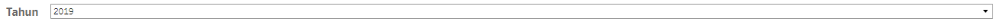
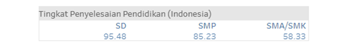
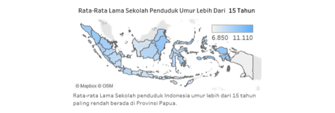
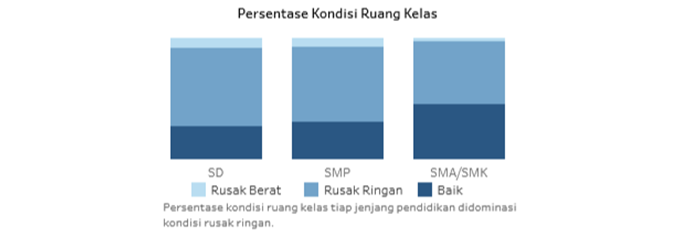

# 221911164-3SD1-Visdat
(Projek UAS take home mata kuliah Visualisasi Data kelas 3SD1 tahun ajaran 2021/2022)

<h2><b>DASHBOARD INTERAKTIF VISUALISASI DATA STATISTIK PENDIDIKAN INDONESIA</b></h2>

<h3><b>Abstrak</b></h3>

Ringkasan— Sarana dan prasarana pendidikan merupakan salah satu faktor yang memengaruhi kualitas pendidikan. Hasil dan capaian proses pendidikan dapat dilihat dari beberapa indikator, diantaranya Angka Melek Huruf (AMH). Rata-rata lama sekolah, dan tingkat penyelesaian sekolah. Secara umum, penelitian ini bertujuan untuk membuat dashboard interaktif dari visualisasi data statistik pendidikan Indonesia tahun 2019,2020,2021 serta melakukan evaluasi dashboard. Data yang digunakan merupakan data sekunder yang bersumber dari publikasi bps, web BPS, dan web Kemendikbud, serta data primer yang bersumber dari hasil kuesioner responden. Anlisis yang digunakan yaitu deskriptif dan inferensia. Visualisasi yang digunakan adalah choropleth map, pie map chart, stacked bar chard, diagram sunburst, dan bubble map. Visualisasi digabungkan dalam sebuah dashboard interaktif. Berdasarkan hasil evaluasi, dengan jumlah responden 10, didapatkan skor 90 sehingga mendapatkan nilai huruf A yang artinya sangat baik. Berdasarkan uji Mann-Whitney dapat disimpulkan bahwa bahwa tidak ada perbedaan persepsi penilaian antara kedua kelompok responden. Dimana kelompok responden terbagi menjadi dua yaitu kelompok lingkup pendidikan dan  kelompok masyarakat masyarakat umum.

Kata Kunci— pendidikan, dashboard, visualisasi, system usability scale, mann-whitney

<h3><b>Tujuan Penelitian</b></h3>

1. 
Membuat visualisasi data interaktif menggunakan tableau tentang sarana dan prasarana pendidikan yang meliputi jumlah sekolah berdasarkan jenjang pendidikan dan provinsi di Indonesia, jumlah perpustakaan di Indonesia, dan kondisi ruang kelas di Indonesia tahun 2019-2021 sehingga bisa diperoleh gambaran perkembangan sarana dan prasarana pendidikan Indonesia dengan lebih cepat dan menarik.

2. 
Membuat visualisasi data interaktif tentang hasil dan capaian proses pendidikan yang meliputi beberapa indikator, yaitu angka melek huruf anak usia ≥15 tahun berdasarkan provinsi, rata-rata lama pendidikan anak usia ≥15 tahun berdasarkan provinsi, serta tingkat penyelesaian pendidikan menurut jenjang pendidikan dan provinsi di Indonesia tahun 2019-2021 sehingga bisa diperoleh gambaran persebaran hasil dan capaian proses pendidikan di tiap provinsi Indonesia dengan cepat dan menarik.

3. 
Membangun dashboard interaktif untuk visualisasi data sarana dan prasarana pendidikan serta hasil dan capaian proses pendidikan tahun 2019-2021 yang mampu menyajikan visualisasi data interaktif secara komprehensif.

4. 
Untuk mengetahui penilaian terhadap dashboard interaktif visualisasi data statistik pendidikan Indonesi oleh pengguna yang terbagi menjadi dua kelompok pengguna.

5. 
Untuk mengetahui perbedaan persepsi penilaian dashboard interaktif visualisasi data statistik pendidikan Indonesia oleh dua kelompok pengguna.

<h3><b>Metodologi Penelitian</b></h3>

Berikut diagram alur penelitian Dashboard Interaktif Visualisasi Data Statistik Pendidikan Indonesia. 

Gambar 1. Alur Penelitian

<b>A. Metode Pengumpulan Data</b>

Data yang digunakan dalam penelitian ini merupakan data sekunder dan primer. Data sekunder merupakan data yang diperoleh melalui media perantara atau secara tidak langsung. Dalam penelitian ini, digunakan enam data sekunder yang berasal dari beberapa sumber. Pertama, yaitu data jumlah sekolah berdasarkan jenjang pendidikan SD,SMP, SMA/SMK menurut provinsi di Indonesia yang bersumber dari Data Pokok Pendidikan Direktorat Jendral Pendidikan Anak Usia Dini, Pendidikan Dasar dan Pendidikan Menengah, Kementrian Pendidikan, Kebudayaan, Ristek dan Teknologi semester ganjil untuk tahun 2019/2020, 2020/2021, 2021/2022. Data dapat diakses pada link https://dapo.kemdikbud.go.id/sp. Data kedua dan ketiga yaitu data persentase ruang kelas menurut jenjang pendidikan dan kondisi serta data jumlah perpustakaan sekolah negeri menurut jenjang pendidikan yang bersumber dari publikasi BPS, yaitu Potret Pendidikan Statistik Pendidikan Indonesia Tahun 2019, Statsitik Pendidikan Indonesia Tahun 2020, dan Statistik Pendidikan Indonesia Tahun 2021. Data keempat yaitu angka melek huruf penduduk umur 15-59 tahun menurut provinsi, kelima data rata-rata lama sekolah penduduk umur ≥15 tahun menurut provinsi, data keenam yaitu data tingkat penyelesaian pendidikan menurut jenjang pendidikan dan provinsi. Data keempat, kelima, dan keenam bersumber dari web Badan Pusat Statistik yang dapat diakses pada link https://bps.go.id/.

Data primer merupakan data yang diperoleh secara langsung yang dikumpulkan dengan metode pengumpulan data, seperti pengisian kuesioner dan lain sebagainya. Dalam penelitian ini, data primer didapatkan dari pengisian kuesioner system usability scale untuk evaluasi dashboard interaktif visualisasi data statistik pendidikan Indonesia. 

<b>B.	Pemilihan Chart dan Pembuatan Visualisasi</b>

Terdapat berbagai jenis chart yang dapat digunakan untuk memvisualkan data. Pemilihan chart disesuaikan dengan jenis data dan kategori yang digunakan.  Untuk melakukan visualisasi data tersebut, peneliti menggunakan tools Tableau.

<b>C.	Pembuatan Desain dan Publikasi Dashboard</b>

Dashboard merupakan tampilan visual dari informasi penting untuk mencapai satu atau banyak tujuan; dikonsolidasikan dan diatur pada satu layar sehingga informasi dapat dimonitor secara sekilas. Esensi dari dashboard yaitu menyajikan informasi untuk mencapai suatu tujuan tertentu yang berada pada satu layar utuh. Dashboard memiliki mekanisme tampilan yang kecil, ringkas, jelas, dan intuitif. Penataan ruang: tempat yang paling penting dilihat dari kiri atas (jika bahasanya ditulis ke kiri kanan) lalu atur tampilan berikut seperti pola huruf Z dengan informasi paling penting mengikuti pola dari atas ke bawah, kiri ke kanan

Dashboard yang di desain dengan baik dapat menyajikan data yang terorganisir dengan baik, terkondensasi, spesifik dan disesuaikan untuk pembaca dan tujuan dari organisasi, serta ditampilkan dengan media yang ringkas agar pesan dashboard tersebut tersampaikan dengan jelas. Pembuatan desain dashboard menggunakan tools Tableau. Dashboard dipublikasikan menggunakan server Tableau Publik.

<b>D.	Evaluasi Dashboard Interaktif</b>

Penelitian ini menggunakan System Usability Scale (SUS) untuk mengevaluasi dashboard interaktif visualisasi data statistik pendidikan Indonesia. Setiawan dan Ravianto (2020), menyebutkan bahwa, System Usability Scale (SUS) adalah kuesioner yang dapat digunakan untuk mengukur usablity sistem pada komputer dari sudut pandang subjektif para pengguna. SUS banyak digunakan untuk mengukur kegunaan dan memiliki beberapa kelebihan. 

Secara teknis, SUS memiliki 10 butir pertanyaan yang dikemas dalam bentuk kuesioner, tetapi dalam pengembangannya bisa dimungkinkan dibuat dalam bentuk gambar yang dinamakan PictorialSUS [11], namun dalam penelitian ini hanya menggunakan kuesioner. Pertanyaan pada kuesioner system usability scale dapat dilihat pada Tabel 1.

Kuesioner SUS memiliki 10 pertanyaan dengan penilaian menggunakan skala liert pada rentang 1-5, dimana poin 1 artinya sangat tidak setuju, 2 artinya tidak setuju, tiga berarti netral, 4 yaitu setuju, dan 5 adalah sangat setuju. Dalam menentukan hasil perhitungan skor SUS, terdapat tiga sudut pandang penelitian, yaitu acceptability, grade scale, dan adjective rating. Seperti pada gambar 2 berikut.

Gambar 2. Standar Penetuan Skor SUS [12]

Pembobotan skor untuk menyatakan status dashboard berada pada rentang 0-100 serta dibagi menjadi 5 nilai huruf dari A,B,C,D, dan  F.

<b>E. Metode Analisis</b>

Pada penelitian ini, dilakukan analisis deskriptif pada data sekunder, yaitu data jumlah sekolah berdasarkan jenjang pendidikan SD,SMP, SMA/SMK menurut provinsi di Indonesia, persentase ruang kelas menurut jenjang pendidikan, kondisi serta data jumlah perpustakaan sekolah negeri menurut jenjang pendidikan, angka melek huruf penduduk umur 15-59 tahun menurut provinsi, rata-rata lama sekolah penduduk umur ≥15 tahun menurut provinsi,serta data tingkat penyelesaian pendidikan menurut jenjang pendidikan dan provinsi di Indonesia untuk tahun 2019-2021. Selain itu, analisis deskriptif juga dilakukan untuk menganalisis penilaian responden terhadap dashboard interaktif visualisasi data statistic pendidikan Indonesia berdasarkan kuesioner yang telah dibagikan. 

Penelitian ini juga menggunakan analisis inferensia menggunakan tools IBM SPSS Statistics 25 untuk melakukan uji Mann-Whitney dengan tujuan mengetahui perbedaan persepsi penilaian dashboard visualisasi data interaktif antara kelompok lingkup pendidikan dan masyarakat umum. Kelompok lingkup pendidikan mencakup mahasiswa jurusan pendidikan, pendidik berbagai jenjang pendidikan, dan sejenisnya. Kelompok masyarakat umum merupakan masyarakat yang tidak tercakup pada kelompok lingkup pendidikan. 

<h3><b>Hasil dan Pembahasan</b></h3>

<b><i>Dashboard</i> Interaktif</b>

Berdasarkan alur pembuatan dashboard yang telah dijelaskan pada metodologi, hasil dashboard interaktif visualisasi data statistik pendidikan Indonesia dapat dilihat pada gambar 3. Dashboard dapat diakses pada link https://public.tableau.com/app/profile/dwi.karunia.syaputri/viz/DashboardInteraktifVisualisasiDataStatistikPendidikanIndonesia_/DASHBOARDPENDIDIKAN?publish=yes. 

Gambar 3. Gambar Tampilan <i>Dashboard</i>

Pada gambar 3 di atas, tampilan dashboard di dominasi warna biru, serta terdapat warna oren, hijau, dan abu-abu pada judul-judul visualisasi. Dashboard tersebut memaparkan data sekunder yang digunakan dalam penelitian ini. Berikut gambar dan penjelasan tiap bagian pada dashboard.

Gambar 4. Gambar Tampilan Judul <i>Dashboard</i>

Judul menjadi salah satu unsur penting dalam dashboard yang merupakan representasi isi dashboard. Judul pada dashboard ini menggunakan warna abu-abu pada background agar membuat mata pembaca fokus pada judul dashboard.

Gambar 5. Fitur Seleksi Tahun pada Tampilan <i>Dashboard</i>

Seperti pada Gambar 5, terdapat fitur untuk  memilih tahun data yang ditampilkan, yaitu 2019,2020, dan 2021. Seluruh visualisasi secara otomatis akan menampilkan data pada tahun yang dipilih pada fitur tersebut. 

Gambar 6. AMH Indonesia

Gambar 7. <i>Choropleth Map</i> AMH

Gambar 6 dan 7 menampilkan angka melek huruf untuk Indonesia dan Angka Melek Huruf berdasarkan provinsi di Indonesia. Data angka melek huruf penduduk umur 15-59 tahun berdasarkan provinsi di Indonesia divisualkan menggunakan choropleth map secara interaktif. Value akan muncul saat pengguna melakukan hover pada provinsi yang ingin dilihat datanya. Di bagian kiri terdapat beberapa fitur, yaitu zoom in dan zoom out peta, filter, search, selection, dan detail on demand. Choropleth map ini digunakan pada data yang memiliki variable geografi, yaitu menampilkan data dalam bentuk peta dengan warna yang berbeda-beda antar daerah sesuai rentang nilai data. Semakin terang warna artinya nilai data pada daerah tersebut semakin rendah, dan sebaliknya, gelap warna artinya nilai data pada daerah itu semakin tinggi

Dari visualisasi tersebut, terlihat bahwa provinsi yang memiliki angka melek huruf terkecil adalah Provinsi Papua, baik untuk tahun 2019,2020, maupun 2021. Saat dilihat antar tahun, angka melek huruf tiap provinsi maupun Indonesia cenderung mengalami peningkatan tiap tahunnya. 

Gambar 8. Tingkat Penyelesaian Pendidikan berdasarkan Jenjang Pendidikan di Indonesia

Gambar 9. Pie Map Chart Tingkat Penyelesaian Pendidikan berdasarkan Jenjang Pendidikan dan Provinsi di Indonesia

Gambar 8 dan 9 menampilkan tingkat penyelesaian pendidikan berdasarkan jenjang pendidikan di Indonesia dan berdasarkan provinsi. Data tingkat penyelesaian pendidikan berdasarkan jenjang pendidikan dan provinsi di Indonesia divisualkan menggunakan pie map chart untuk menggambarkan ketiga jenjang pendidikan di tiap provinsi. Terlihat juga dari tahun 2019-2021 tingkat penyelesaian pendidikan mengalami peningkatan.

Gambar 10. Rata-rata Lama Sekolah Penduduk Umur ≥15 Tahun di Indonesia

Gambar 11. Choropleth Map Rata-rata Lama Sekolah Penduduk Umur ≥15 Tahun Menurut Provinsi di Indonesia

Rata-rata lama sekolah penduduk umur ≥15 tahun menurut provinsi di Indonesia divisualkan menggunakan choropleth map. Seperti yang telah dijelaskan sebelumnya, bahwa Choropleth map digunakan pada data yang memiliki variable geografi, yaitu menampilkan data dalam bentuk peta dengan warna yang berbeda-beda antar daerah sesuai rentang nilai data. Semakin terang warna artinya nilai data pada daerah tersebut semakin rendah, dan sebaliknya. Pada choropleth map rata-rata lama sekolah penduduk umur ≥15 tahun menurut provinsi di Indonesia juga terdapat fitur zoom in dan zoom out peta, filter, search, selection, dan detail on demand. Terlihat bahwa rata-rata lama sekolah terkecil berada pada Provinsi Papua, baik untuk tahun 2019,2020, maupun 2021. Rata-rata data cenderung meningkat tiap tahunnya. 

Gambar 12. Diagram Sunburst Jumlah Sekolah Berdasarkan Jenjang Pendidikan dan Provinsi di Indonesia

Jumlah sekolah antar jenjang pendidikan dan provinsi di Indonesia berbeda-beda. Data jumlah sekolah berdasarkan jenjang pendidikan dan provinsi di Indonesia divisualkan menggunakan diagram sunburst. Referensi [13] menjelaskan bahwa sunburst merupakan metode dalam teknik visualisasi yang berbentuk radial space filling. Teknik visualisasi sunburst untuk menampilkan suatu struktur seperti pohon (tree). Item hierarki didalam sunburst dibentuk secara radial, dengan bagian hierarki utama terletak di tengah/center dan bagian yang lebih jauh dari pusat center adalah cabang dari data hierarki tersebut. Sudut yang memiliki kesamaan warna bersesuaian dengan atribut datanya.
Berdasarkan diagram sunburst tersebut, terlihat bahwa jumlah sekolah didominasi oleh jenjang pendidikan sekolah dasar. Jumlah sekolah mengalami peningkatan dari tahun ke tahun. 

Gambar 13. Stacked Bar Chart Persentase Ruang Kelas di Indonesia Menurut Jenjang Pendidikan dan Kondisi

Kondisi ruang kelas perlu mendapat perhatian untuk meningkatkan kualitas pendidikan. Data persentase ruang kelas di Indonesia menurut jenjang pendidikan dan kondisi divisualkan menggunakan stacked bar chart. Visualisasi stacked bar chart digunakan untung membandingkan banyak item berbeda dan menunjukkan komposisi setiap item yang ingin dibandingkan. Dalam penelitian ini, item atau kategori yang ingin dibandingkan adalah jenjang pendidikan dan persentase kondisi ruang kelas.
Berdasarkan visualisasi tersebut, terlihat bahwa kondisi ruang kelas di Indonesia didominasi oleh kondisi rusak ringan.

Gambar 14. Bubble Map Jumlah Perpustakaan Berdasarkan Jenjang Pendidikan di Indonesia

Data jumlah perpustakaan berdasarkan jenjang pendidikan di Indonesia divisualkan menggunakan bubble map. Lizana & Ridho (2021), menjelaskan bahwa bubble map digunakan pada data kategorik yang tidak memiliki nilai negatif. 
Visualisasi bubble map pada penelitian ini menggunakan warna yang berbeda tiap kategori berbeda. Ukuran bubble map menyesuaikan besaran nilai data. Semakin besar jumlah perpustakaan pada jenjang pendidikan tersebut maka ukuran lingkaran juga semakin besar. 
Dari visualisasi tersebut, terlihat bahwa jumlah perpustakaan paling banyak berada pada jenjang pendidikan sekolah dasar. Jumlah perpustakaan juga meningkat tiap tahunnya, terlihat dari tahun 2019,2020, dan 2021. 

<b>Evaluasi <i>Dashboard</i> Interaktif</b>

 